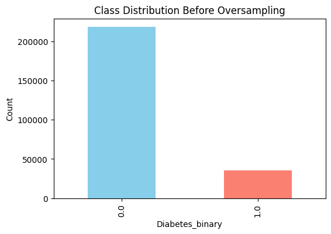
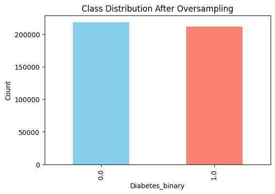
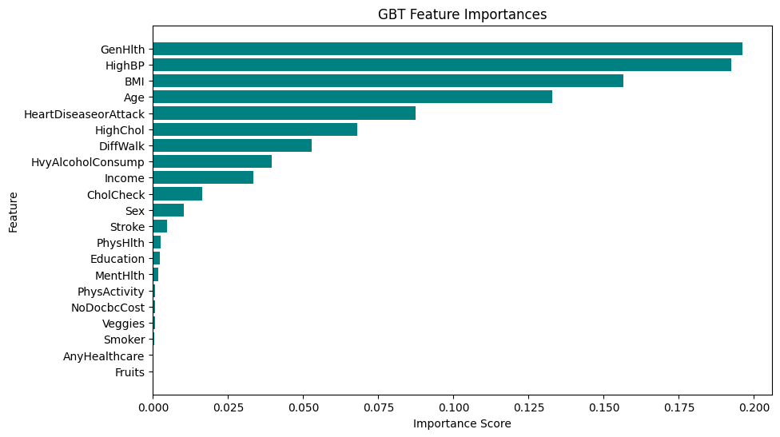
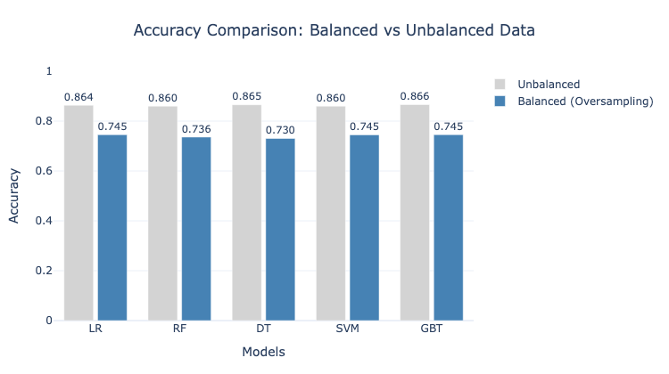

# Diabetes Prediction Using PySpark

A scalable machine-learning pipeline built using PySpark MLlib to predict diabetes using health-related indicators from the CDC BRFSS dataset. The project demonstrates distributed data processing, class-imbalance handling, ML model training, feature importance analysis, and performance comparison.

---

## 📊 Dataset

Source: https://www.kaggle.com/datasets/alexteboul/diabetes-health-indicators-dataset  

Rows: ~253,680  

Features: 22 health indicators  

Target: `Diabetes_binary` (1 = Diabetes, 0 = No Diabetes)  

The dataset is heavily imbalanced, making class balancing an essential part of the workflow.

---

## 🧠 Approach

This project follows a complete end-to-end ML workflow using PySpark:

### 🔍 1. Data Exploration & Preparation

- Loaded and inspected the dataset schema  
- Checked distributions, missing values, and feature summaries  
- Converted PySpark DataFrames to Pandas when needed for visualization  

### ⚖️ 2. Handling Class Imbalance

- Identified strong imbalance in the diabetes label  
- Oversampled the minority class using a PySpark `explode`based approach  
- Visualized class distribution **before** and **after** oversampling  

### 🧱 3. Feature Engineering

- Used `VectorAssembler` to combine numeric columns into a single feature vector for MLlib models  

### 🤖 4. Model Training (Unbalanced & Balanced Data)

Trained five ML models:

- Logistic Regression  
- Random Forest  
- Decision Tree  
- Support Vector Machine (LinearSVC)  
- Gradient Boosted Trees (GBT)  

Each model was trained twice:

- On the original **unbalanced** dataset  
- On the oversampled **balanced** dataset  

### 📐 5. Cross-Validation

- Applied 3-fold cross-validation on the balanced dataset  
- Tuned parameters for LR, RF, DT, SVM, and GBT  

### 📈 6. Evaluation & Comparison

- Compared all models using **accuracy, precision, recall, and F1-score**  
- Built a **Balanced vs Unbalanced** accuracy comparison chart  
- Extracted **Feature Importances** from GBT and visualized them  

---

## 📊 Key Visualizations

### 📉 Class Distribution Before Oversampling


Shows how the dataset is heavily skewed toward the non-diabetic class, motivating the need for balancing.

### 📈 Class Distribution After Oversampling


Illustrates the effect of oversampling, where both classes are brought to a similar scale for fair model training.

### 🌲 GBT Feature Importances


Highlights which health indicators (e.g., General Health, HighBP, BMI, Age, Heart Disease) contribute the most to diabetes prediction.

### ⚖️ Accuracy Comparison – Balanced vs Unbalanced


Compares model performance on the original vs oversampled dataset, showing how balancing improves stability and reduces bias.

---

## 🔍 Key Insights

- The original dataset is **highly imbalanced**, so naïve models tend to favor the majority (non-diabetic) class.  
- **Gradient Boosted Trees (GBT)** consistently achieved the best overall performance across both unbalanced and balanced datasets.  
- **Oversampling** improved accuracy for all models and helped reduce majority-class bias.  
- Features such as **General Health, HighBP, BMI, Age, and Heart Disease** showed the strongest predictive influence.  
- **Cross-validation** made the results more reliable by reducing variance across different train–test splits.  
- Overall, PySpark MLlib handled the large dataset efficiently and is well-suited for **scalable health-risk prediction**.

---

## 👥 My Role in the Project

This work was completed as part of a team project. My main contributions were:

- Building the **PySpark ML pipeline** for the diabetes prediction task  
- Implementing **class imbalance handling** using oversampling and validation checks  
- Training and evaluating the **five ML models** on both unbalanced and balanced data  
- Creating **visualizations** for class distribution, feature importance, and model comparison  
- Organizing the **notebook structure** and documenting the workflow so others can follow it easily  

This project reflects my ability to work with large datasets, design practical ML experiments, and communicate results clearly.

---

## 📂 Project Structure

```text
diabetes-prediction-using-pyspark/
│
├── diabetes_prediction_ml.ipynb        # Main PySpark ML notebook
│
├── images/                             # Visualizations used in the README
│   ├── class_distribution_before.png
│   ├── class_distribution_after.png
│   ├── gbt_feature_importance.png
│   └── accuracy_comparison_balanced_vs_unbalanced.png
│
└── README.md                           # Project documentation
```
Note: The dataset itself is not stored in the repository.
Download it from Kaggle and place it in your environment when running the notebook.

---

## 🛠 Tech Stack

- PySpark MLlib

- Python

- Pandas, NumPy

- Matplotlib, Plotly

- Google Colab / Jupyter Notebook

---

## ▶️ How to Run

### Clone the repository

```
git clone https://github.com/ksriya2002/diabetes-prediction-using-pyspark.git
cd diabetes-prediction-using-pyspark
```

### Install dependencies
```
pip install pyspark pandas numpy matplotlib plotly
```

### Open the notebook

Open diabetes_prediction_ml.ipynb in Jupyter Notebook or Google Colab.

### Run the workflow

Run all cells in order to reproduce:

- data loading & exploration

- oversampling and feature engineering

- model training & cross-validation

- visualizations and comparisons

---

## 📫 Contact
📧 Email: sriyareddy696@gmail.com

Feel free to reach out with any questions or feedback.
